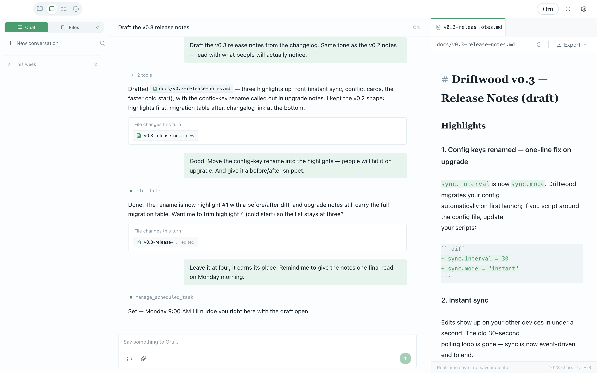

<div align="center">

**English** · [简体中文](README.zh-CN.md)

</div>

---

# Oru

Oru is an AI collaborator that lives on your machine. It has long-term memory, remembers your choices and experiences, and learns continuously from working with you.

Oru runs as a desktop application, offering a smooth file-viewing and editing experience organized around conversation. You and the AI read files, write documents, and build slides in the same window. You can also issue commands to Oru through third-party platforms (currently Feishu / Discord).

Currently macOS only. Pre-1.0 / Alpha stage.



## What you can do with it

|  |  |
|---|---|
| **Collaborative editing** | Tell it what to change and it edits while you watch the result on the right; make further tweaks yourself if needed |
| **Long-term memory** | Preferences, habits, and important information mentioned in chat are remembered automatically, so you don't repeat yourself |
| **Multi-platform** | Chat with it privately in Feishu or Discord and see the full context mirrored on desktop |
| **Screen pointing** | Hold Option and click anywhere on screen; Oru starts a conversation from the exact spot you point at |
| **Documents & slides** | Produce documents and presentations directly in conversation, preview them on the spot, and export to PDF / PPT |
| **Bilingual interface** | Full Chinese / English UI, all copy internationalized (i18n), switchable at any time |
| **Scheduled tasks** | Set a time and Oru executes a task automatically, notifying you when done |
| **Extensions** | Connect external services over the standard MCP protocol; install plugins and custom skill packs |
| **Model backends** | Anthropic API, OpenAI-compatible endpoints, or the locally logged-in Claude Code |


## Getting started

For first use you run from source (no installer yet):

```bash
git clone <repo-url>   # TODO(before release): replace with the new repo URL
cd oru
nvm use
npm install
npm run dev
```

After launching, follow the onboarding to enter an API key.

**About the model**: By default Oru can run on the Anthropic API, OpenAI-compatible endpoints (including OpenRouter / Zhipu / Kimi), or reuse a locally logged-in Claude Code. To make full use of Oru's capabilities — especially **screen pointing** (hold Option and say "right here", which requires recognizing the screen region you indicate) and reading images — we recommend a model with vision input; Oru performs noticeably better in these scenarios.

> Requires macOS and Node.js (the repo ships its own configuration; nothing extra to install). The first time you use "hold Option, point here", the system requests Screen Recording permission (Oru needs to see the screen location you indicate); declining does not affect the rest of the app.

## Optional: web search

By default Oru does not go online and answers from training knowledge only (**it will still read URLs you provide directly**). To let it search for up-to-date information, configure a search engine in Settings:

1. Open **Settings › Capabilities › Web Search**
2. Turn on **Enable web search**
3. Click **+ Add engine**, pick one, and enter an API key

Three engines are currently supported:

| Engine | Notes | Where to apply |
|---|---|---|
| **Bocha** | Chinese-friendly, direct access in mainland China | https://bochaai.com |
| **Tavily** | Overseas, requires a proxy | https://tavily.com |
| **AnySearch** | Accessible overseas without a proxy; strong on technical/academic queries, slightly slower | https://anysearch.com |

Once configured, Oru performs web searches when you explicitly ask it to ("search for / look up"). Online activity still only happens when you initiate it (see *Data & privacy* below).

## Data & privacy

- All data stays on your computer (under `~/.oru` and in your project folders)
- No telemetry collected, no account system
- Online actions (model calls, web searches) happen only when you initiate them
- You can view and edit Oru's memory content at any time

## License

MIT. Pre-1.0 / Alpha stage — issues and feedback are very welcome.

## For developers

- **Architecture**: Electron desktop app, main process + renderer, operating directly on the local file system
- **Model calls**: cloud models via API (Anthropic / OpenAI-compatible), or reuse your local Claude Code subscription
- **Extension protocol**: standard MCP (Model Context Protocol), compatible with any external service
- **Versioning**: file-edit history is independent of git, with rollback support; your project's git is unaffected
- **Permission model**: three tiers (read-only / work / danger); operations beyond the current tier generate a confirmation card
- **Memory system**: three separate profiles (user preferences / Oru state / project context), automatically consolidated each night

**Chat history**: All conversations are kept in the conversation list in the sidebar, grouped by time (today / this week expanded, older ones collapsed). The sidebar search covers both conversation titles and message bodies, with keyword highlighting; open any past conversation and send a message to continue with full context. Conversations waiting on you are automatically floated to the top of the list.

**Slash commands**: Type a slash command in the desktop input box; it executes immediately on send (and is not fed to the model as a message):

- `/new` start a new conversation
- `/stop` interrupt the running task
- `/mode readonly｜work｜danger` switch the approval tier
- `/model` list available models; `/model <n>` switch the global main-conversation model
- `/compress` compress the current conversation's context manually
- `/status` show a status snapshot (tier, model, busy/idle, queue length)
- `/help` pop up the full command panel

An invalid command (for example `/mode` with an unknown tier) also pops up the panel with usage hints.
