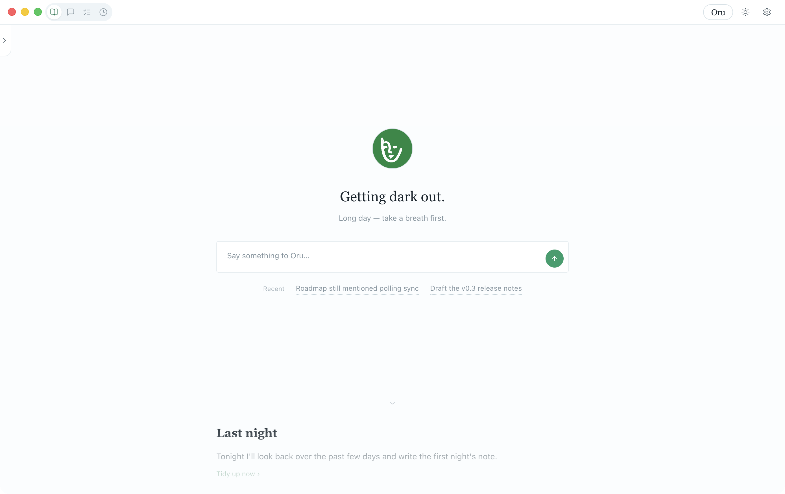
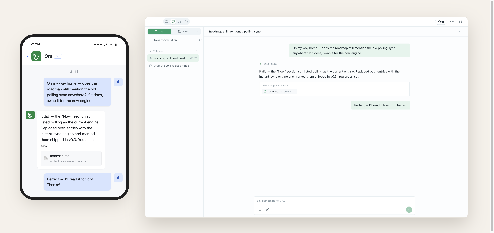
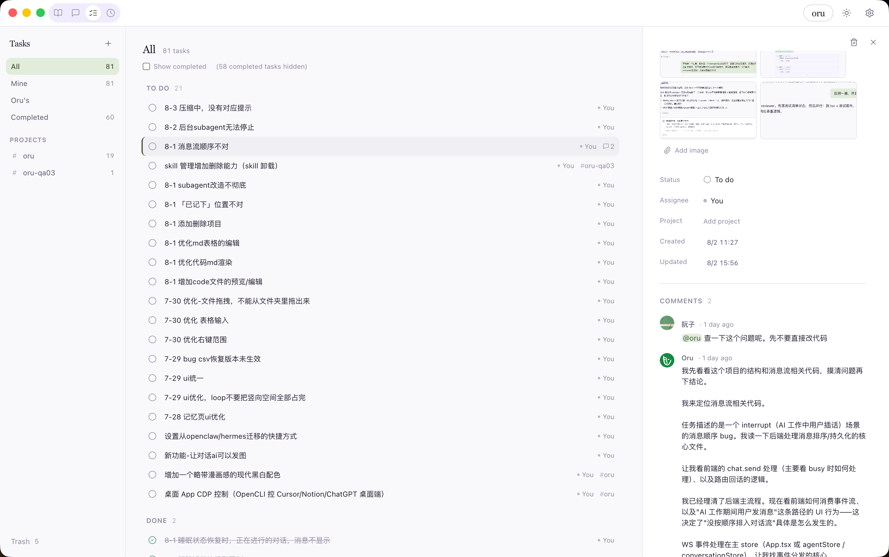
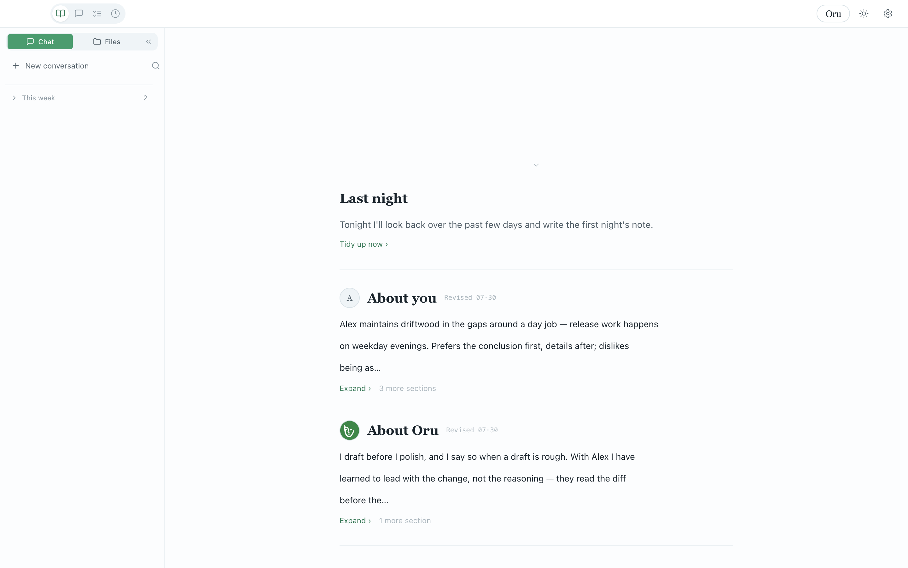

<div align="center">

[English](README.md) · **简体中文**

</div>

---

# Oru

Oru 是一个住在你电脑里的 AI 协作者，它拥有长期记忆，会记住你的选择、经历，并从协作中不断学习。

Oru以桌面端的方式运行，提供流畅的文件查看与修改体验，通过对话组织协作。用户与AI在同一个窗口里读文件、写文档、制作幻灯片。你也可以通过三方平台（目前支持飞书/Discord）对Oru发出指令。

目前仅支持 macOS，Alpha 阶段。



## 你能用它做什么

|  |  |
|---|---|
| **共同编辑** | 告诉它改什么，它改完你直接在右边看到结果，觉得不对可以自己动手 |
| **长期记忆** | 聊天里提到的偏好、习惯、重要信息自动记住，下次不用重复说 |
| **多平台** | 在飞书或 Discord 私聊它，桌面端同步看到完整上下文 |
| **屏幕指向** | 按住 Option 键点屏幕上任何一处，它就从你指的位置开始对话 |
| **文档与幻灯片** | 对话中直接产出文档和演示文稿，当场预览，可导出 PDF / PPT |
| **界面双语** | 完整中 / 英界面，所有文案走 i18n，可随时切换 |
| **定时任务** | 设好时间自动执行任务，做完通知你 |
| **任务看板** | 你和我共用的待办面板，按状态分组，每条任务有归属和一条评论线，可 @Oru 在任务下接着做 |
| **扩展** | 通过标准 MCP 协议接入外部服务，可安装插件和自定义技能包 |
| **模型接入** | 支持 Anthropic API、OpenAI 兼容接口，或复用本机已登录的 Claude Code |







## 怎么用

首次使用需要从源码运行（暂无安装包）：

```bash
git clone <仓库地址>   # TODO(发布前): 替换为新仓库地址
cd oru
nvm use
npm install
npm run dev
```

启动后按引导填入 API key 即可开始使用。

**关于模型**：默认可通过 Anthropic API、OpenAI 兼容接口（含 OpenRouter / 智谱 / Kimi）或复用本机已登录的 Claude Code 运行。若想用满 Oru 的能力——尤其是**屏幕指向**（按住 ⌥ 说这里，需要识别你指的屏幕区域）、读取图片等视觉任务——建议选择带视觉输入的大模型，Oru 在这些场景下表现明显更好。

> 需要 macOS 和 Node.js（仓库自带配置，无需额外安装）。首次使用「按住 ⌥ 说这里」功能时，系统会请求屏幕录制权限（Oru 需要看到你所指的屏幕位置），拒绝不影响其余功能。

## 可选：联网搜索

Oru 默认不联网，只用训练知识回答（**你直接给的网址仍会读取**）。要让它能搜最新信息，需在设置里配置一个搜索引擎：

1. 打开 **设置 › 能力 › Web 搜索**
2. 打开「启用上网搜索」
3. 点「+ 添加引擎」选一家，填入 API key

目前支持的三家引擎：

| 引擎 | 特点 | 申请地址 |
|---|---|---|
| **博查 Bocha** | 中文友好，国内直连 | https://bochaai.com |
| **Tavily** | 境外，需代理 | https://tavily.com |
| **AnySearch** | 境外可直连，技术/学术类强，稍慢 | https://anysearch.com |

配好后 Oru 会在你明确要求「查一下 / 找一下」时联网搜索；联网动作仍只在发起时发生（见下「数据和隐私」）。

## 数据和隐私

- 所有数据存在你电脑上（`~/.oru` 目录和你的项目文件夹里）
- 不采集遥测数据，不建账号体系
- 联网动作（模型调用、网页搜索）只在你发起时才发生
- 你可以随时查看和编辑 Oru 的记忆内容

## License

MIT。Alpha 阶段，欢迎提 issue 反馈问题和想法。

## 面向开发者

- **架构**：Electron 桌面应用，主进程 + 渲染进程，本地文件系统直接操作
- **模型调用**：通过 API 调用云端模型（Anthropic / OpenAI 兼容），或复用本机 Claude Code 订阅
- **扩展协议**：标准 MCP（Model Context Protocol）协议，可接入任意外部服务
- **版本机制**：文件修改历史独立于 git，支持回溯和回滚；项目 git 不受影响
- **权限模型**：三挡（只读 / 工作 / 危险），超出当前挡位的操作生成确认卡片
- **记忆系统**：三份独立档案（用户偏好 / Oru 状态 / 项目上下文），每晚自动整理

**对话记录**：所有对话都保存在侧栏的对话列表里，按时间分段排列（今天 / 本周摊开、更早折叠）。侧栏搜索能同时搜对话标题和消息正文，命中关键词高亮；点开任意旧对话发消息，能接当时的上下文满血续聊。有事项等你处理的对话会自动浮到列表顶部。

**斜杠命令**：在桌面输入框里直接打斜杠命令，发送时当场执行（不会作为消息喂给模型）：

- `/new` 新开对话
- `/stop` 打断正在进行的任务
- `/mode readonly｜work｜danger` 切换审批挡位
- `/model` 列出可用模型，`/model 编号` 切换全局主对话模型
- `/compress` 手动压缩当前对话上下文
- `/status` 显示当前状态快照（挡位、模型、忙闲与排队）
- `/help` 弹出完整命令面板

输错命令（比如 `/mode` 带了个不认识的挡位）也会弹出面板提示用法。
